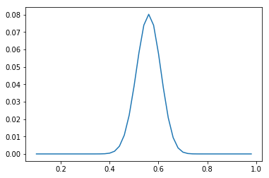

# MLE
* Maximum likelihood estimation
* Parameter(모수)가 미지의 $\theta$인 확률 분포에서 뽑은 표본(관측값) $x$을 통해 $\theta$를 추정하는 기법
* `likelihood`(우도)는 주어진 표본 $x$들에 비추어 봤을때 모집단의 모수 $\theta$에 대한 추정이 그럴듯한 정도를 뜻함
* 우도 $L(\theta|x)$는 $\theta$가 전제되었을때, $x$가 등장할 확률인 $p(x|\theta)$에 비례함

* $L(P(H)=0.5|E) = \frac{100!}{56!44!}0.5^{56} 0.5^{44} = 0.0389$
* 동전 100번 던지기를 수행할때, 앞면 56번 나왔다면, "동전을 던졌을 때 앞면이 나올 확률"은 얼마? --> MLE, L(T|E), E 앞면이 나왔다는 사실, 이론 T를 변화시키면서 어느 이론이 가장 그 확률이 높은지 찾는 과정

* 이를 python으로 코드화해보면 아래와 같음

```python
import math

p_h_old = p_h = 0.1
l_r = 0.02
l_old = 0.0
max_iter = 100 
p_h_list = []
l_list = []
for i in range(max_iter):
    l = math.factorial(100)/(math.factorial(56)*math.factorial(44))*math.pow(p_h, 56)*math.pow(1.0-p_h,44)
    #print(p_h, l)
    p_h_list.append(p_h)
    l_list.append(l)
    if l_old < l:
        print("{} : new p_h={:.5f}, likelihood={:.5f}".format(i, p_h, l))
        l_old = l
        p_h_old = p_h
    p_h += l_r
    if p_h>1.0:
        break
    
print(">>> p_h={}, likehood={}".format(p_h_old, l_old))
    
==============================
0 : new p_h=0.10000, likelihood=0.00000
1 : new p_h=0.12000, likelihood=0.00000
2 : new p_h=0.14000, likelihood=0.00000
3 : new p_h=0.16000, likelihood=0.00000
4 : new p_h=0.18000, likelihood=0.00000
5 : new p_h=0.20000, likelihood=0.00000
6 : new p_h=0.22000, likelihood=0.00000
7 : new p_h=0.24000, likelihood=0.00000
8 : new p_h=0.26000, likelihood=0.00000
9 : new p_h=0.28000, likelihood=0.00000
10 : new p_h=0.30000, likelihood=0.00000
11 : new p_h=0.32000, likelihood=0.00000
12 : new p_h=0.34000, likelihood=0.00000
13 : new p_h=0.36000, likelihood=0.00002
14 : new p_h=0.38000, likelihood=0.00011
15 : new p_h=0.40000, likelihood=0.00044
16 : new p_h=0.42000, likelihood=0.00154
17 : new p_h=0.44000, likelihood=0.00444
18 : new p_h=0.46000, likelihood=0.01080
19 : new p_h=0.48000, likelihood=0.02224
20 : new p_h=0.50000, likelihood=0.03895
21 : new p_h=0.52000, likelihood=0.05812
22 : new p_h=0.54000, likelihood=0.07395
23 : new p_h=0.56000, likelihood=0.08016
>>> p_h=0.5600000000000002, likehood=0.0801646400718097
```
* 최대우도는 0.08016를 갖을때, 확률값이 P=0.56 : `동전을 던져서 앞면이 나올 확률은 0.56이다`라 할수 있음

* plotting을 해보면 아래와 같음

```python
%matplotlib inline
import matplotlib.pyplot as plt
plt.plot(p_h_list, l_list)
```



* $\theta$에 대해 편미분을 해, 0인 지점을 구하는 방법도 있음

* 모수 추정에 최대우도추정기법을 자주 이용, 하지만 관측치(표본/데이터)에 큰 영향을 받음.. --> 이를 보완하는 다양한 기법이 제안되었다함
* 데이터가 전체 데이터를 커버하면, 최대우도기법을 통해서, 실제 모수를 추정가능하다고 볼수 있겠음..

# reference
* http://databaser.net/moniwiki/pds/BayesianStatistic/%EB%B2%A0%EC%9D%B4%EC%A6%88_%EC%A0%95%EB%A6%AC%EC%99%80_MLE.pdf
* https://ratsgo.github.io/statistics/2017/09/23/MLE/
* 